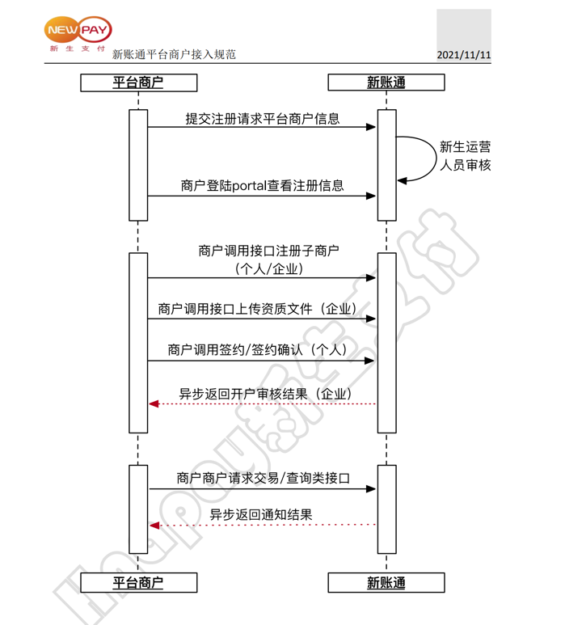

# HnaPay-Java
新生支付Java封装，简化开发，提高效率；新生支付官网：https://www.hnapay.com/
<div style="text-align: center;font-weight: bold;color: red">该包待测试，请勿用于生产</div>

---------------------

> 若该开源项目存在侵权行为，请及时联系我进行删除。

### 接入准备
1. 完成商户注册工作，获取商户在新账通平台的密钥
2. 接口所有报文密文须先进行 RSA 非对称加密运算之后转Base64编码，字符中不能包含不可见字符（换行符、空格、TAB 等）
3. 所有接口签名均先进行 RSA 签名运算之后转 Base64 编码，字符中不能包含不可见字符（换行符、空格、TAB 等）。
4. 所有交易均使用商户在新账通平台的密钥进行签名验签。

### 对接流程


### 已完善接口对接
#### 开户相关
1. [x] 个人开户接口
2. [x] 用户查询接口
3. [ ] 用户账户明细查询接口

#### 账户管理相关
1. [x] 绑卡接口
2. [x] 绑卡确认接口
3. [x] 个人用户解绑接口

#### 交易相关
1. [x] 收货确认接口
2. [x] 快捷支付下单接口
3. [x] 快捷支付确认接口
4. [x] 提现接口
5. [ ] 退款接口
6. [x] 转账接口
7. [ ] 分期费率查询接口
##### 刷脸接口
1. [ ] 刷脸支付获取token接口

### Maven 引用方式
注意：请认准groupId 为`wiki.ganhua`。
```xml
<dependency>
    <groupId>wiki.ganhua</groupId>
    <artifactId>HnaPay-Java</artifactId>
    <version>1.0.0</version>
</dependency>
```
